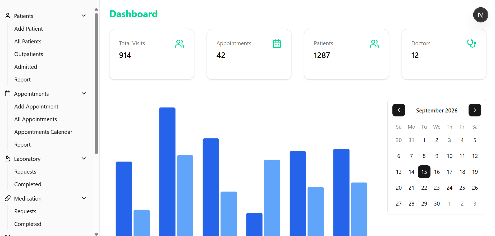

# Small Scale Electronic Health Record (EHR) System



Full-stack web application for secure patient management and appointment scheduling.

**Purpose:** a focused interface for managing patients, appointments, visits, orders, and vitals used as a reference implementation and internal tool.

## Key Features

- Appointment scheduling and calendar views
- Patient management and quick search
- Visit records and vitals tracking
- Orders and labs workflow scaffolding
- Authentication and role-aware UI

## Tech Stack

- Frontend: Next.js + React + TypeScript
- Styling: global CSS & PostCSS (project uses component-driven UI)
- Backend / ORM: Prisma with PostgreSQL
- Auth: Better Auth
- Tooling: Node.js, npm, ESLint, PostCSS

## Quickstart

Prerequisites:

- Node.js 18+ installed
- PostgreSQL (local or remote) for development

Typical setup:

```bash
# 1. Install dependencies
npm install

# 2. Set up environment variables
cp .env.example .env
# then fill in BETTER_AUTH_SECRET: npx auth secret

# 3. Run database migrations and seed (if applicable)
npx prisma migrate dev --name init
npx prisma db seed

# 4. Start the dev server
npm run dev

# Open http://localhost:3000
```

Notes:

- Generated Prisma client is in `src/generated/prisma` (do not commit local engine files).
- `npm run build` needs none of the environment variables; see [Environment Variables](#environment-variables).
- If you use a different package manager, replace `npm` with `yarn` or `pnpm`.

## Scripts

- `npm run dev` — run the Next.js development server
- `npm run build` — build the production app
- `npm run start` — run the production build
- `npx prisma generate` — regenerate Prisma client
- `npx prisma migrate dev` — create/apply migrations

## Environment Variables

These are **runtime** variables. `npm run build` needs none of them: the build
imports every server module to collect page data, and nothing in the app reads the
environment until a request needs it. So a build succeeds with no database
running and no secret configured, and a misconfigured deployment fails on its
first request instead — naming the variable, not printing a library diagnostic.
See [ADR 0003](docs/adr/0003-build-independent-runtime-state.md).

| Variable | Required | Purpose |
| --- | --- | --- |
| `DATABASE_URL` | yes | Postgres connection string |
| `BETTER_AUTH_SECRET` | yes | Secret Better Auth signs session cookies with. `AUTH_SECRET` is accepted as a legacy fallback. |
| `BETTER_AUTH_URL` | in practice | Canonical app URL. Better Auth derives the origin from the incoming request when it is unset, which breaks callbacks and redirects. |

Generate the auth secret rather than inventing one:

```bash
npx auth secret   # or: openssl rand -base64 32
```

There may be additional provider-specific variables required for social providers
configured in `src/lib/auth.ts`.

## Database and Prisma

Schema and migrations are located in the `prisma/` directory. Typical workflow:

```bash
npx prisma migrate dev --name descriptive_change_name
npx prisma generate
npx prisma db seed
```

Inspect the current schema in `prisma/schema.prisma` and the migration SQL files in `prisma/migrations/`.

## Testing & Linting

- ESLint is configured in `eslint.config.mjs`. Run `npm run lint` if available.
- Add tests and CI configuration as needed.

## Deployment

This app is ready to deploy to Vercel, Render, Docker, or any platform that
supports Next.js + Node.

The only rule is that the runtime variables above must be set wherever the app is
**served** — not where it is built. A platform that injects build-time and
runtime variables separately is the case this app is built for: the build
deliberately receives nothing, and the running process reads the variables on its
first request.

Recommended Vercel settings:

- Build command: `npm run build`
- Output directory: (Next.js default)

### Docker

The image is a multi-stage build: the builder compiles the standalone Next bundle
and never holds a secret or a database, because `.dockerignore` excludes `.env*`
from the build context. Runtime variables reach the container through Compose's
`env_file`, and `DATABASE_URL` is overridden there to point at the `db` service.

Put `BETTER_AUTH_SECRET` in `.env` before the first `up`. Compose does not demand
it at startup, because the only way to make it demand that (`${VAR:?}`) is
evaluated while the file is parsed — which would make `docker compose build`
require the secret too, and put the build back in the coupling ADR 0003 removes.
Without it the app builds and starts, then the first request fails naming the
variable.

```bash
docker compose up --build              # db + app on http://localhost:3000
docker compose --profile dev up        # db + next dev on http://localhost:3001
```

`docker-entrypoint.sh` runs `prisma migrate deploy` before serving, so the schema
is current by the time the first request arrives.

## Contributing

- Open an issue for bugs or feature requests.
- Create a branch named `feat/your-feature` or `fix/your-fix` and submit a pull request against `dev` or `main` depending on workflow.

Please run linters and formatters before opening PRs.

## Troubleshooting

- If Prisma complains about migration history, check `prisma/migrations` and ensure the `DATABASE_URL` points to the expected database.
- For auth issues, verify `BETTER_AUTH_URL`, `BETTER_AUTH_SECRET`, and any configured social-provider credentials.
- `MissingRuntimeConfigError` means a runtime variable is unset in the process that served the request. It names the variable; set it there, not in the build.
- A build that prints `PrismaClientInitializationError` or a Better Auth secret warning has reintroduced a build-time dependency. See [ADR 0003](docs/adr/0003-build-independent-runtime-state.md).

## Maintainers & Contact

Maintained by the repository owner. For questions or access, open an issue or contact the maintainer via the repository.

## License

See the `LICENSE` file if present. If no license is included this repository is not publicly licensed — contact the maintainer for terms.
